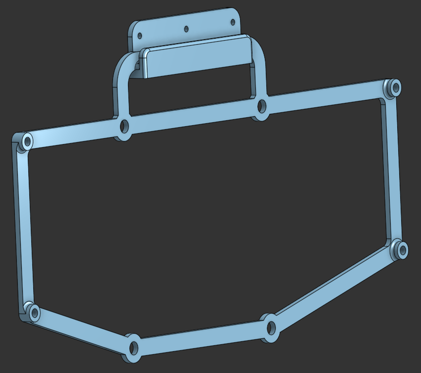

# Driggs Kiosk

This is a client that displays images from my Immich server and displays them onto a digital picture frame I made with a Raspberry Pi and portable monitor.


## MECHANICAL

Link to [OnShape](https://cad.onshape.com/documents?nodeId=6f4d76e23843bc47101345e0&resourceType=folder) 3D model, stored in the [mech](mech/) folder:




## HARDWARE

- [15.6 in Portable Monitor](https://www.amazon.com/dp/B0D2D8CCY1) with:
    - 1920 x 1080 resolution (16:9 aspect ratio)
    - HDMI input
    - Touchscreen
    - Built in speakers
    - 12V input
    - Looks good. A lot of them look bad.
- [12V 5A Power Supply](https://www.amazon.com/dp/B0CW2PJQLJ)
- [12V in to 5V 5A out Power Adapter]()
- [Raspberry Pi 4 1GB](https://www.canakit.com/raspberry-pi-4.html) (or Raspberry Pi Zero 2 W)
- HDMI to Micro HDMI cable
- Micro SD card
- Command strips
- Soldering iron and heatshrink


## SOFTWARE

Diet Pi OS is a lighter version of the Raspberry Pi OS that enables my limited Raspberry Pi Zero 2W to run significalty faster.
1. [Download for Raspberry Pi 4](https://dietpi.com/?ref=fanyangmeng.blog#downloadinfo)
2. [How to install DietPi](https://dietpi.com/docs/install/)


I edited the files stored in the [driggs-kiosk/rpi4/] folder by following the docs on [deitpi's website](https://dietpi.com/docs/software/desktop/#chromium). When I booted into chromium, it was extremely blurry, so I disabled hardware acceleration in chromium:
```bash
chromium-browser --disable-gpu http://driggs-zb:8014
```


Install Tailscale and follow the prompts after running:
```bash
curl -fsSL https://tailscale.com/install.sh | sh
```


## MONITORING

!FUTURE!:
- What happens when Wifi goes down?
