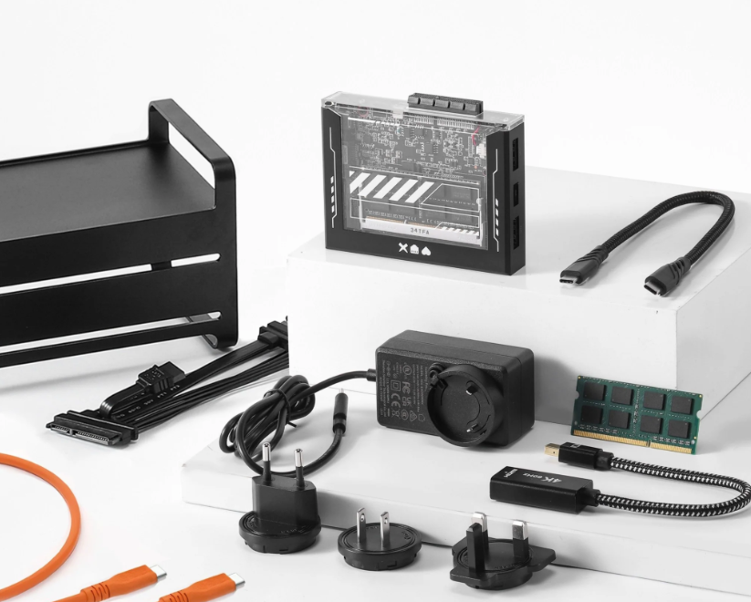

# ZimaBlade 7700

The [ZimaBlade 7700](https://shop.zimaspace.com/products/zimablade-single-board-server-for-cyber-native?variant=47722451730724) is my main server and [Network Attached Storage (NAS)](http://shop.zimaspace.com/products/zimablade-deskbuild-nas-kit). It's a nice step up from something like a Raspberry Pi because it proves an x86 operating system, two SATA ports, and the NAS kit comes in at $165 USD.

## RESOURCES

- This is the video that convinced me to get the ZimaBlade: [Tiny NAS! ZimaBlade NAS Kit Review - Jellyfin Install, Linux/CasaOS, & 2 NAS HDDs](https://youtu.be/2eP0ff2nmIM?si=lQh1YlRYHEZL2oJK) by [Tek Syndicate](https://www.youtube.com/@teksyndicate).
- Another helpful video: [Home Servers Have NEVER Been This Easy: CasaOS + ZimaBoard](https://youtu.be/w44CypRO5l4?si=K86x_VdJyfkrF_5P) by [Hardware Haven](https://www.youtube.com/@HardwareHaven)